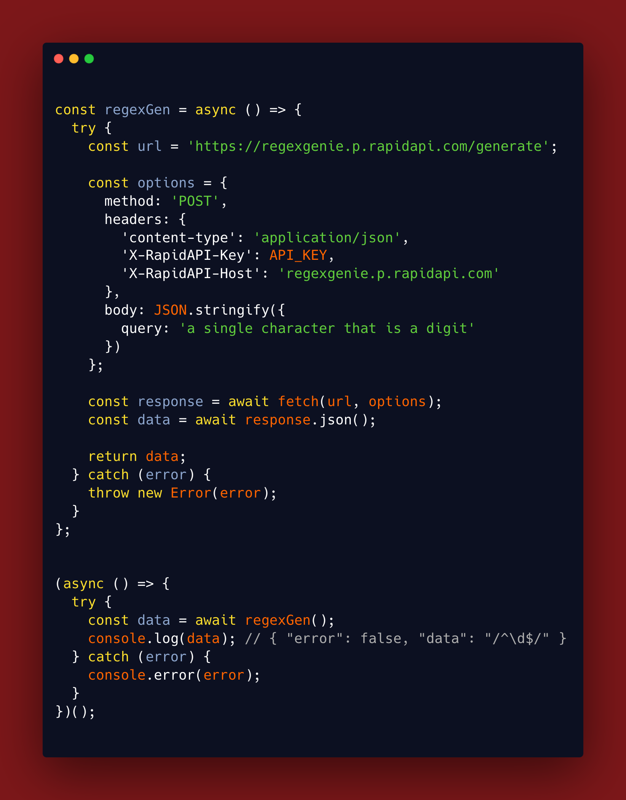

# Carbon API

Create beautiful images of your source code thanks to Carbon API. Typescript and Javascript support.



## Options

| Name            | Type    | Default | Description                                                           |
| --------------- | ------- | ------- | --------------------------------------------------------------------- |
| lang            | string  | auto    | Language to use for syntax highlighting.                              |
| theme           | string  | dracula | Theme to use for the code.                                            |
| font            | string  | Hack    | Font to use for the code.                                             |
| windowControls  | boolean | true    | Whether to show window buttons on top of the window                   |
| widthAdjustment | boolean | true    | Whether to adjust the width of the code to its content                |
| lineNumbers     | boolean | true    | Whether to show line numbers on the left of the code                  |
| firstLineNumber | number  | 1       | The number to start counting lines from                               |
| watermark       | boolean | false   | Whether to show the Carbon watermark on the bottom right of the image |
| fontSize        | number  | 18      | The font size to use for the code                                     |
| lineHeight      | number  | 169     | The line height to use for the code                                   |
| exportSize      | number  | 2       | The pixel density to export the image at                              |

## Usage

```js
import { Carbon } from 'carbon-now';

const carbon = new Carbon({
  lang: 'javascript',
});

async () => {
  const code = `console.log('Hello world!');`;

  const imagePath = await carbon.generate(code, 'image.png');
  // imagePath = /path/to/image.png
};
```

### Notes

- This is an unofficial API for [Carbon](https://carbon.now.sh/). It is not affiliated with [Carbon](https://carbon.now.sh/) in any way.
- Check all the available themes, langs and fonts [here](./src/types.ts).
